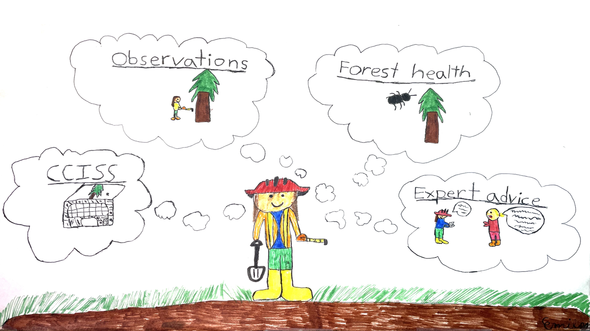
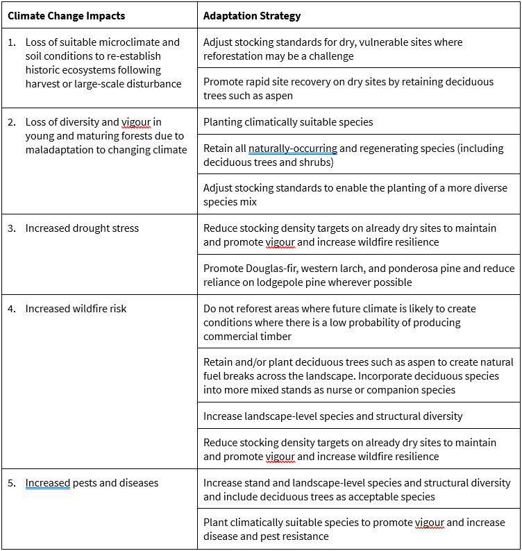

# Decision Guidance

## Appropriate use of the CCISS tool

The CCISS tool is a decision aid, not a crystal ball. CCISS leverages the vast BEC knowledge base to provide predictions of changes in environmental suitability of tree species for more than 1000 site types across British Columbia. These site-specific predictions provide essential insights for reforestation. However, CCISS predictions are not intended to be taken at face value. Instead, they are a starting point for policymakers and practitioners to embark on professional decisions that weigh multiple factors and lines of evidence.

CCISS is a complex analysis with many components, and therefore many sources of error and uncertainty. Interpretation of CCISS environmental suitability predictions often requires examining the components of the analysis—the climate model projections, biogeoclimatic analogs, and baseline environmental suitability ratings—to separate useful results from potentially misleading model artefacts. The CCISS tool is designed to allow users to “look under the hood” and evaluate the results from many angles and spatial scales, to gain a complete understanding of the underlying drivers of each prediction.

### Intended users

Given the effort and training required to interpret CCISS results, we do not intend the CCISS tool to serve as the authoritative source of practitioner guidance on climate change informed tree species selection. Instead, we anticipate that stocking standards will remain the primary reference for species selection, and that CCISS results will be integrated with other considerations in the development of updated stocking standards. The CCISS tool is intended for decisionmakers and practitioners who have invested sufficient training time to correctly interpret CCISS results.

### Intended uses

While the development of climate change informed stocking standards is the primary intended use of CCISS, the CCISS tool is useful for many other applications.

-   **Reforestation prescriptions**—Practitioners can use the CCISS tool to inform their prescriptions (within the constraints of stocking standards) and export CCISS results as documentation of due diligence.
-   **Landscape-level species diversification strategies**—The CCISS tool facilitates assessment of species environmental suitability trends at landscape and regional scales, which is a core prerequisite for managing the landscape profile of tree species to minimize climate change vulnerabilities (Mah et al. 2012). To further advance this effort, the CCISS team is developing a quantitative analysis to spread climate change risk across a complementary portfolio of tree species.
-   **Climate change vulnerability assessment**—CCISS environmental suitability ratings are primarily derived from the historical presence of the species in mature natural stands. predicted declines in tree species environmental suitability can therefore indicate risks to mature and old stands. Consequently, CCISS results can be relevant to management of old growth, wildlife habitat, hydrology, carbon sequestration, and other ecosystem services.

## Policy context for climate change informed tree species selection

The CCISS tool is made available as an information product within the existing legislative and policy framework. This framework encourages, and in some cases requires, climate change considerations to be incorporated into forest management. The necessity to integrate climate change in reforestation decisions has been mandated by Ministry leadership for at least 12 years (Ethier 2013). More recently, amendments to Forest and Range Practices Act have included provisions to adapt to climate change when establishing a Forest Landscape Plan. Despite these imperatives, widespread consideration of climate change in stocking standards and other forest policy has been hampered by a lack of comprehensive predictions of future tree species suitability at the operational (i.e. site-series) scale. CCISS represents a major step forward in government’s ability to deliver on its mandate to account for climate change in reforestation.

### Statutory and regulatory basis for climate change informed species selection

The expectation to account for climate change in reforestation decisions was initially highlighted in a 2009 memo by Chief Forester Jim Snetsinger: “As more information becomes available through ongoing climate change research on topics such as facilitated migration, vulnerability, and seed transfer, this new information should be used to adapt stocking standards accordingly” (Snetsinger 2009). The legal basis for considering climate change in species selection was further clarified in 2013 by ADM Tom Ethier: “The impacts of climate change need to be considered as part of the *Forest Planning and Practices Regulation* Section 26 long-term forest health test both by those preparing Forest Stewardship Plans and those reviewing plans submitted for approval or extension” (Ethier 2013).

This directive was followed by updates to the Chief Forester’s Reference Guide for Stocking Standards that accounted for climate change using a precursor to the CCISS method (Ministry of Forests, Lands and Natural Resources Operations 2014). These updates included additions of species outside their current geographic range where supported by evidence of current and future suitability. The updates were not comprehensive; they were limited to a subset of regions, species, and sites.

Most recently, the necessity to account for climate change in forest management was embedded in the objectives for preparing a Forest Landscape Plan (FLP): FRPA requires the chief forester to consider “preventing, mitigating and adapting to impacts caused by significant disturbances to forests and forest health, including wildfire, insects, disease and drought” in establishing an FLP (*Forest and Range Practices Act*, S.B.C. 2002, c. 69, s. 2.21). The chief forester must also consider any other forest ecosystem values identified by Indigenous Peoples and local communities (*Forest and Range Practices Act*, S.B.C. 2002, c. 69, s. 2.21), which provides another way for those groups to reiterate their need to address the impact of climate change if desired. After the FLP objectives are set, the plan holders need to demonstrate how they achieve the FLP objectives with supporting stocking standards. In the case where addressing climate change impact is a priority for an FLP, the plan holder can link the climate change strategy directly to stocking standards.

In summary, there is clear direction and provincial forest policy supporting the integration of climate change into reforestation. To that end, the CCISS tool improves Government’s ability to provide supportive guidance for FSPs and FLPs, and to evaluate proposed plans against climate-related establishment tests.

### Policy neutrality of CCISS projections

The CCISS tool is policy-neutral: CCISS projections are not management recommendations. CCISS environmental suitability ratings indicate environmental constraints on establishment and survival, not the relative desirability of species for reforestation. While the E1 (high suitability) rating indicates minimal environmental constraints, the E2 (moderate suitability) rating indicates that specific silvicultural practices are likely required for successful stand development. Examples of these practices are: a shelterwood silviculture system to mitigate drought and/or frost risk; site preparation and/or microsite selection; and reduced stocking densities to mitigate inter-tree soil moisture competition. Where these practices align with management objectives, a species with an E2 rating may be preferred over a species with an E1 rating.

Further, projections of current or future environmental suitability outside the historical range of a tree species do not necessarily indicate that the species should be planted there. CCISS does not promote assisted range expansion of tree species. It simply indicates where and when assisted range expansion could lead to successful establishment and survival

### Relationship to Climate-Based Seed Transfer (CBST)

Climate-Based Seed Transfer (CBST) is the Province’s system for ensuring that tree seed used for reforestation is climatically adapted to the locations where it is deployed. CBST accounts for climate change and is specified at the biogeoclimatic subzone-variant level. However, the CBST methodology is different from the CCISS methodology; it specifies transfer limits in terms of climatic differences (distances) rather than biogeoclimatic projections. There are no plans to merge CCISS and CBST into one system. Species selection and seedlot selection are distinct decisions that can be managed as separate sequential steps.

In theory, there is potential for CCISS and CBST to provide conflicting information; i.e., where CCISS indicates a species is suitable but CBST does not provide seedlots. However, CBST provides seedlots for a geographical range that typically exceeds the geographical range of tree species suitability. Consequently, there likely are few cases in practice where CBST constrains tree species selection (Greg O'Neill, pers. comm. 2025). Currently, CBST uses a secondary filter that constrains seedlot selection based on modeled tree species suitability projections from the UBC Centre for Forest Conservation Genetics. This filter can be ignored when using CCISS for species selection, since CCISS provides a more site-specific species suitability projection. In the long term, measures will be taken to more fully harmonize CCISS and CBST. In the interim, it is viable in most cases to use CCISS for species selection and then CBST for seedlot selection.

## Integrating CCISS results into tree species selection

CCISS is intended as an input to tree species selection decisions, not as a definitive answer. CCISS provides a foundation of BEC-based interpretations that is comprehensive (all species for all site series across BC) but incomplete. Any tree species selection decision needs to account for other information, synthesized through professional judgement, including non-BEC factors, sources of error, and other lines of evidence (Figure 1).

<figure>

<figcaption style="font-size: 1.0em; color: gray;">

Figure 1: Climate change informed species selection is a professional decision, in which CCISS tool results are considered alongside other sources of information. Illustration by Emily von der Porten.

</figcaption>

</figure>

### Non-BEC factors

CCISS adds a climate change dimension to the tree species interpretations of the BEC system. This approach accounts for many of the climatic and site factors in tree species selection. However, there are many non-BEC factors that are not directly accounted for in CCISS:

-   **Insects & disease**—The role of forest health factors is explicitly excluded from the CCISS environmental suitability ratings, with the intention that they are a separate layer of information in reforestation decisions.

-   **Silvicultural systems**—Species suitability for reforestation is strongly affected by overstorey shade, site preparation, and microsite selection. In some cases, specialized silviculture practices will be required to establish trees on novel sites for which they are likely to be suitable in the future. Silviculture considerations are to some extent captured in CCISS implicitly or via footnotes. However, CCISS projections may in some cases underestimate the current silvicultural feasibility of tree species because they do not account for the role of silviculture practices in compensating for climate and site constraints.

-   **Migration lag**—The historical range (i.e. realized niche) of tree species in British Columbia in many cases may be smaller than their potential range (i.e. fundamental niche) due to migration lags following the end of the last glaciation (Griesbauer et al. 2025). Since CCISS suitability ratings are generally based on historic species ranges of the mid to late 20th century (1961-1990), migration lags are another reason why CCISS projections are likely to underestimate the assisted range expansion potential of some tree species.

-   **Extreme weather**—The current CCISS methodology assumes that changes in the mean climate are representative of changes in the extremes (the stationarity assumption). This is a reasonable starting point, and a necessary one since incorporating climate extremes into the CCISS analysis is not technically feasible at present. However, climate change clearly violates the stationarity assumption: the 2021 Pacific Northwest heat dome vividly illustrates that the distribution of extremes is changing across all regions. The change in extremes relative to the mean is another dimension of novelty in the climates of the future, and thus another way in which spatial climate analogs can under-represent climate changes. The extent to which extreme weather is significant for long-term CCISS projections is undetermined, but deserves careful consideration during species selection.

### Sources of error

Understanding potential sources of error is essential for appropriate use of the CCISS tool. The CCISS methodology has many components such as the species environmental suitability ratings, climate modeling, and biogeoclimatic projections. of these components have their own degree of error that can carry through into the CCISS tool results, emphasizing the importance of professional scrutiny in the interpretation of these results.

-   **Environmental suitability ratings**—Tree species’ environmental tolerances are complex and many approximations are required to translate them into the simple suitability ratings metric used in CCISS. Suitability ratings for each tree species in each site series have been assigned primarily through expert judgement with support from vegetation plot data. There are inevitably errors in this database, particularly for species that were not historically prominent in reforestation, such as deciduous species. The suitability ratings are undergoing ongoing review by the CCISS team and regional ecologists.

-   **Climate mapping**—The reference climate maps for CCISS are the 1981-2010 PRISM (Parameter-elevation Regressions on Independent Slopes Model) climate surfaces of temperature and precipitation at 800m spatial resolution developed by the Pacific Climate Impacts Consortium. These surfaces are best-in-class, but they have important limitations. They are interpolated from weather station data that is sparse in many regions of BC. Most valleys and some larger regions have no stations, so the nuances of climate in these locations may not be well represented, particularly cold air drainage and elevational gradients. Further, the PRISM method does not model microclimatic factors such as heat loading (warm vs. cold aspects), vegetation influences, and lake effects. Microclimatic factors need to be accounted for during professional interpretation of CCISS results.

-   **Climate data downscaling**—Climate changes are modeled in CCISS by overlaying very coarse-scale global climate model projections (50-150km grid resolution) onto the 800m-resolution PRISM climate maps, a method called change-factor downscaling. This approach results in a uniform warming rate from valley bottom to mountain top. In reality, we expect elevation-dependent differences in warming rate due, for example, to loss of snowpack. Similarly, change-factor downscaling can’t represent the role of other fine-scale features like lakes, vegetation, cold-air pooling, aspect, and soil moisture in modifying the regional average climate change. CCISS users are encouraged to consider the role of site-specific modification of regional climate changes

-   **Biogeoclimatic (BGC) projections**—Biogeoclimatic modeling involves using machine learning to classify climate conditions as biogeoclimatic units (subzones/variants). We have found that BGC projections are sensitive to many aspects of model training, especially climate variable selection. As of current, Biogeoclimatic models are not able to fully reconstruct the mapped data with which they were trained on, resulting in fuzzy boundaries and the over- and underrepresentation of certain BGC units. The current version of CCISS BGC projections is imperfect, and future refinements will be made. For more information, refer to the Biogeoclimatic Projections technical report.

-   **Novel climates**—No climate analog is perfect; the biogeoclimatic analogs that underlie CCISS projections will all, to some extent, mismatch the future climatic conditions they are selected to represent. Future climates thar are highly dissimilar to their closest biogeoclimatic analog are called ‘novel climates’. The CCISS novel climate detection analysis estimates analog goodness-of-fit and discards biogeoclimatic analogs for novel climates, as they are likely to provide misleading tree species suitability projections. Where novel climates comprise a substantial portion of the CCISS model result, users must use other methods of selecting tree species suitable for the area of interest. However, climatic novelty should be assumed to be a source of error in all CCISS results. Users are encouraged to use multiple lines of evidence to corroborate the CCISS tool.

### Other lines of evidence

The current CCISS analysis is a modeling methodology with inherent assumptions and sources of error. For this reason, species selection decisions should be based on multiple lines of quantitative and qualitative evidence. Practitioners are encouraged to integrate the following information sources into their decisions:

-   **Observations**—The observed performance of tree species within and outside their historical range is essential information to corroborate CCISS tool results. A formal adaptive management framework for CCISS is needed to continually update our understanding of what works and what doesn’t work as the climate changes. In the interim, there are several sources of observational information. Research installations such as the AMAT and FUTURE trials provide rigorous species performance information for some regions and site types. Many off-site species trials have been informally established over several decades and these can be used opportunistically to indicate the potential viability of a tree species outside of its historical range (Griesbauer et al., 2025). Offsite trial locations are compiled in the by-BEC Portal, which accepts practitioner contributions of observations and locations. The Ministry of Forests has also established a protocol for establishment of operational off-site species trials, providing licensees and practitioners with the opportunity to contribute to a shared adaptive management effort. The annual forest health Aerial Overview Surveys provide information on trends in drought, insect, and disease damage.

-   **Forest Drought Assessment Tool (ForDRAT)**—ForDRAT provides modeled projections of tree species drought risk. It uses a different method than CCISS and so is a useful second line of modeling evidence for moisture-limited species and sites.

-   **Expert advice**—Ministry of Forests regional ecologists, silviculturists, and forest health specialists are available for consultation on specific questions. The Future Forest Ecosystems Centre can answer questions about CCISS tool results via email (ffec\@gov.bc.ca) or GitHub (https://github.com/bcgov/CCISS_Review/issues). More broadly, there is a wealth of localized expertise on species selection among forest professionals; formal and/or informal communities of practice are likely essential to effective climate change informed species selection.

-   **Professional experience**—ultimately, tree species selection is a professional decision. The suitability of tree species must make sense to the practitioner, given their knowledge of the spccies, the site, the observed impacts of climate change, and the projected future changes in climate.

## Example—Climate change informed stocking standards for the Cariboo-Chilcotin

This is a summary of a stocking standards development exercise conducted by Wesley Brookes, Guy Burdikin, Bill Layton, and Mark Seilis of Cariboo Carbon Solutions Ltd. (Brookes et al., 2022). Their approach exemplifies professional judgement in climate change informed species selection by integrating climate change projections, CCISS tool results, other lines of evidence, differentiated management objectives, and operational experience.

The stocking standards development proceeded in the following steps:

1.  Review climate change projections for seasonal temperature/precipitation and extremes.

2.  Identify climate change impacts and corresponding adaptation strategies (Table 1).

3.  Specify distinct management objectives for differentiated stocking standards (in this case, timber production and wildfire resilience).

4.  Create a shortlist of candidate preferred species from CCISS tool results.

5.  Demote species (from preferred to acceptable) where CCISS suitability is E3 and the ForDRAT tool indicates a current drought risk of High to Very High.

6.  Promote or demote species based on professional judgement and operational experience.

7.  Further exclude or demote species based on their alignment with the management objectives of the stocking standard.

<figure>

<figcaption style="font-size: 1.0em; color: gray;">

Table 1: Climate change impacts and adaptation strategies for incorporation into the stocking standards decision framework (Brookes et al., 2022).

</figcaption>

</figure>

The resulting stocking standards demonstrate several examples of professional judgement in climate change informed species selection:

-   Inclusion of species (with restrictions) to fulfil unique microsites even though they are predicted to become maladapted to the dominant conditions of site series. An example is retention of lodgepole pine as an acceptable species on IDFxm/01b site series despite the CCISS tool indicating loss of suitability by 2040. This allows lodgepole pine to be planted in depressions or other microsites prone to frost where other preferred/acceptable species such as Douglas-fir and ponderosa pine are unsuitable.

-   Integration of operational experience. For example, the introduction of ponderosa pine as acceptable species on all mesic and drier site series in the IDFdk4 despite CCISS projections indicating a majority unsuitable rating on mesic sites. This assessment was based on relative success of ponderosa pine over Douglas-fir and lodgepole pine in wildfire restoration treatments on these sites in the previous three years.

-   In some instances, species deemed suitable by CCISS were removed from the recommended stocking standards due to site-specific characteristics. An example is the exclusion of Douglas-fir from the IDFdk4/08 due to the high risk of growing season frosts. In other instances, species that were not deemed suitable in the CCISS outputs were classed as having a low drought risk by the ForDRAT tool. These species were included as acceptable.

-   Inclusion of deciduous tree species on subhygric (wetter than mesic) sites in Wildfire Resilience stocking standards, where the CCISS tool predicts their suitability.

## References

Ethier, Tom. 2013. [Consideration of Climate Change When Addressing Long-Term Forest Health in Stocking Standards](https://www2.gov.bc.ca/assets/gov/farming-natural-resources-and-industry/forestry/silviculture/stocking-standards/climate-change/consideration_of_climate_change_memo.pdf). Memorandum 280-30/194604. Ministry of Forests, Lands and Natural Resource Operations, Victoria, BC.

Government of British Columbia. 2002. [Forest and Range Practices Act](https://www.bclaws.gov.bc.ca/civix/document/id/complete/statreg/02069_01), S.B.C. 2002, c. 69.

Government of British Columbia. 2025. [Forest landscape plans](https://www2.gov.bc.ca/gov/content/industry/forestry/managing-our-forest-resources/forest-landscape-plans). Website. Accessed August 25, 2025.

Shirley Mah, Kevin Astridge, Craig DeLong, Craig Wickland, Melissa Todd, Leslie McAuley, Phil LePage, Dave Coates, Ben Heemskerk, Allen Banner, and Erin Hall. 2012. [A landscape-level species strategy for forest management in British Columbia: exploration of development and implementation issues](http://www.for.gov.bc.ca/hfd/pubs/Docs/Tr/Tr067.htm). Prov. B.C., Victoria, B.C. Tech. Rep. 067.

Ministry of Forests, Lands and Natural Resources Operations. 2014. [Updates To The Reference Guide For FDP Stocking Standards (2014): Climate Change Related Stocking Standards](https://www2.gov.bc.ca/assets/gov/farming-natural-resources-and-industry/forestry/silviculture/climate-change-adaptation/2014_fdp_stocking_standards_update.pdf). Victoria, BC.

Snetsinger, Jim. 2009. [Guidance on Tree Species Composition at the Stand and Landscape Level](https://www2.gov.bc.ca/assets/gov/farming-natural-resources-and-industry/forestry/chief_forester_guidance_on_tree_species_composition.pdf). Memorandum 280-30/TREESP. Ministry of Forests and Range, Victoria, BC.
